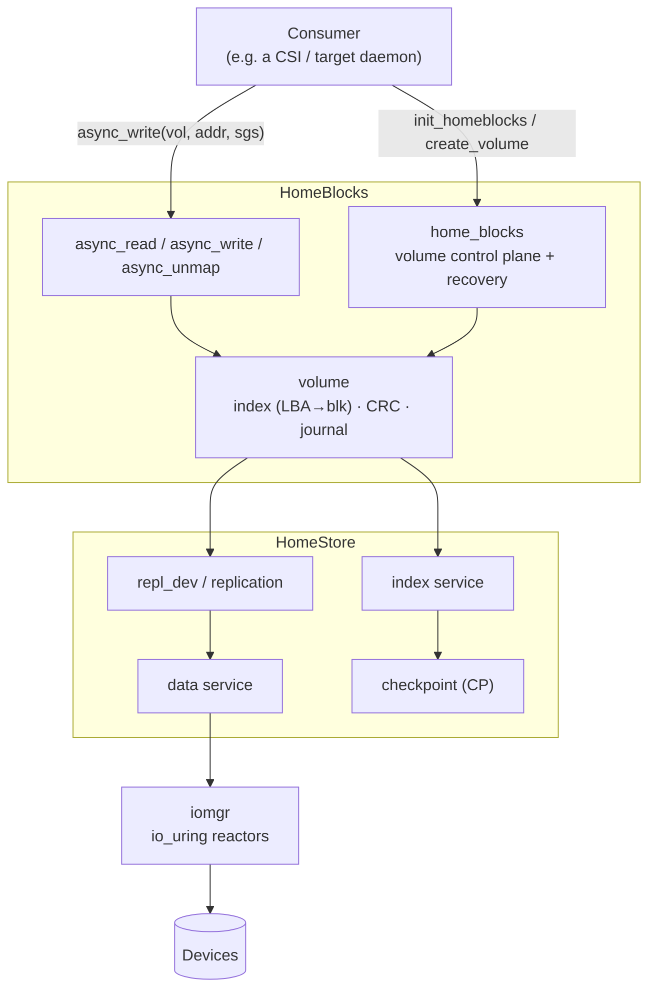

# HomeBlocks

[](LICENSE)

> A crash-consistent block-volume store built on [HomeStore](https://github.com/eBay/HomeStore) — thin-provisioned
> volumes with a replicated, checkpointed data path, exposed through a small C++23 coroutine API.

HomeBlocks turns a set of raw devices into named **volumes**: each is a sparse, block-addressable store with its
own `LBA → block` index, per-block CRC, and a write-ahead journal, all riding HomeStore's replication, indexing,
and checkpoint machinery. The public surface is one header and a handful of coroutine entry points.

## 🚀 Features

- **Volumes** — create / destroy / look up thin-provisioned block volumes; survive process restarts and crashes
  via journal replay and a destroy-resume path.
- **Coroutine I/O** — byte-addressed `async_read` / `async_write` / `async_unmap` return lazy
  [stdexec](https://github.com/NVIDIA/stdexec) coroutines (`sisl::async::task`); `co_await` one, or fan out a
  batch with `when_all`. No callbacks, no futures.
- **One error type** — every fallible call returns `std::expected<T, std::error_condition>`; domain failures use
  a small `volume_error` enum, everything else maps to `std::errc`. No exceptions on the I/O path.
- **Opaque handles + factory init** — consumers never construct an implementation type; they hold a
  `volume_handle` and a `std::shared_ptr<home_blocks>` produced by `init_homeblocks()`.
- **Minimal surface** — the entire public API is a single installed header, `<homeblks/home_blocks.hpp>`.
- **Replicated & checkpointed** — data, index, and journal flow through HomeStore's repl-dev / index / CP
  services; HomeBlocks owns volume lifecycle and recovery on top.

## 📋 Table of Contents

- [Quick Start](#-quick-start)
- [Architecture](#%EF%B8%8F-architecture)
- [Using HomeBlocks](#-using-homeblocks)
- [Development](#%EF%B8%8F-development)
- [Testing](#-testing)
  - [Exercising a volume as a block device (ublk)](#exercising-a-volume-as-a-real-block-device-ublk)
- [Dependencies](#-dependencies)
- [License](#-license)

## 🏃 Quick Start

### Prerequisites

- Linux (io_uring-capable kernel)
- Conan 2.x
- CMake 3.22+
- A C++23 compiler (GCC 13+, Clang 17+)

### Build

```bash
git clone https://github.com/eBay/HomeBlocks
cd HomeBlocks
conan build . -s build_type=Debug --build missing
```

This configures, builds the `homeblocks` library, and runs the unit tests. Artifacts land under
`build/Debug/`.

### Build Options

```bash
# Release
conan build . -s build_type=Release --build missing

# Coverage report (build/Coverage/)
conan build . -o "homeblocks/*:coverage=True" --build missing

# Address / thread sanitizer (build/Sanitized/)
conan build . -o "homeblocks/*:sanitize=True" --build missing

# Index layout: fixed (default) vs prefix-compressed btree
conan build . -o "homeblocks/*:fixed_index=False" --build missing
```

## 🏗️ Architecture

HomeBlocks is the volume layer. It owns volume identity, the per-volume `LBA → block` index, checksums, the
write journal, and crash recovery; HomeStore underneath provides replication, the index/data services, and
checkpointing; iomgr provides the io_uring reactor model.



### Project Structure

```
HomeBlocks/
├── src/include/homeblks/
│   └── home_blocks.hpp          # the entire public API (one installed header)
├── src/lib/
│   ├── homeblks_impl.{hpp,cpp}  # home_blocks instance: init, shutdown, recovery, reaper
│   ├── volume_mgr.cpp           # control plane + free-function I/O (async_read/write/unmap)
│   ├── volume/                  # the volume: index tables, repl-dev I/O, chunk selector, io_req
│   ├── listener.{hpp,cpp}       # HomeStore repl_dev_listener (on_commit / snapshot hooks)
│   ├── memory_backend/          # in-memory variant used by tests
│   ├── hb_internal.hpp          # internal prelude (LOG* macros, size constants, aliases) — not installed
│   └── tests/                   # gtest unit + I/O tests
└── conanfile.py
```

### Core Abstractions

- **`home_blocks`** — opaque handle to a running instance, produced by `init_homeblocks()`. Owns the volume
  control plane (`create_volume` / `remove_volume` / `get_volume` / `volume_ids` / stats).
- **`volume_handle`** (`std::shared_ptr<volume>`) — opaque handle to one volume; the I/O free functions take it.
- **`home_blocks_config`** — bring-up config (devices, reactor threads, memory budget, and a cold-boot
  `on_svc_id` identity hook).
- **`async_read` / `async_write` / `async_unmap`** — free functions over a `volume_handle`; byte-addressed,
  scatter-gather, coroutine-returning.
- **`result<T>` / `async_result<T>`** — the synchronous and coroutine flavors of the one error surface.

## 📦 Using HomeBlocks

Everything is in one header:

```cpp
#include <homeblks/home_blocks.hpp>
using namespace homeblocks;
```

### Bring up an instance

```cpp
auto hb_res = init_homeblocks(home_blocks_config{
    .devices = {{"/dev/nvme0n1"}, {"/dev/nvme1n1"}},
    .threads = 2,
    // Optional: on first boot (no persisted svc id) HomeBlocks calls this to fetch/assign one -- e.g. a gRPC
    // to an orchestrator. Resolve the (possibly rotated) client inside the closure.
    .on_svc_id = [&](/* */) -> async_result<peer_id_t> { co_return co_await orch.register_node(); },
});
if (!hb_res) { /* hb_res.error().message() — e.g. OM unreachable */ return; }
std::shared_ptr<home_blocks> hb = *hb_res;
```

### Volumes and I/O (in a coroutine)

```cpp
sisl::async::task<void> demo(std::shared_ptr<home_blocks> hb) {
    // create_volume hands back the volume; the handle is often discarded and re-fetched with get_volume() later.
    auto vol = co_await hb->create_volume(volume_info{uuid, /*size*/ 1ull << 30, /*page_size*/ 4096, "vol1"});
    if (!vol) co_return;                            // vol.error()

    // Write 8 KiB at byte offset 0. addr/len are RAW BYTE offsets (block-aligned); the sg_list carries the data.
    sisl::sg_list sgs{.size = 8192, .iovs = {iovec{buf, 8192}}};
    auto w = co_await async_write(*vol, /*addr=*/0, sgs);
    if (!w) { /* w.error(): std::errc::no_space_on_device, volume_error::OFFLINE, ... */ }

    // Fan out independent ops with when_all instead of chaining:
    auto [a, b] = co_await sisl::async::when_all(async_read(*vol, 0, rsgs), async_write(*vol2, 4096, wsgs));
}
```

From a non-coroutine context (a gRPC handler, `main`), drive the lazy task to completion off-reactor with
`stdexec::sync_wait(...)`.

### Error handling

One type across the surface — `std::expected<T, std::error_condition>`:

```cpp
auto v = hb->get_volume(id);
if (!v) {
    if (v.error() == volume_error::UNKNOWN_VOLUME) { /* no such volume */ }
    else if (v.error() == std::errc::operation_not_supported) { /* restricted mode */ }
    return;
}
auto& vol = *v;
```

`volume_error` holds only HomeBlocks-specific failures (`UNKNOWN_VOLUME`, `CRC_MISMATCH`, `INDEX_ERROR`,
`INTERNAL_ERROR`, `OFFLINE`); anything with a standard meaning is returned as `std::errc::*`
(`invalid_argument`, `no_space_on_device`, `io_error`, `operation_not_supported`, ...). Both compare directly
against the returned `error_condition`.

## 🛠️ Development

### Code Style

- 4-space indent, 120-column lines, `#pragma once`, C++23.
- Run `./apply-clang-format.sh` before committing (CI enforces it).

### Naming

| Element | Convention | Example |
|---|---|---|
| Public API types & functions (`include/homeblks/`) | `lower_snake_case` | `home_blocks`, `volume_handle`, `async_write()` |
| Public factories | `init_*` / free functions | `init_homeblocks()` |
| Internal implementation classes (`src/lib/`) | `PascalCase` | `HomeBlocksImpl`, `VolumeChunkSelector` |
| Methods | `snake_case` | `create_volume()`, `get_volume()` |
| Members | trailing `_` | `vol_map_`, `config_` |

Implementation types (`HomeBlocksImpl`, the concrete `volume`, the chunk selector) never appear in the installed
header; consumers only ever see opaque handles produced by the factory functions.

### Workflow

```bash
# 1. write code + tests
# 2. format
./apply-clang-format.sh
# 3. build + test
conan build . -s build_type=Debug --build missing
```

## 🧪 Testing

Google Test, built and run as part of `conan build`. The suite covers volume lifecycle/recovery, the data I/O
path (with read-back CRC verification), and the chunk selector:

```bash
build/Debug/src/lib/volume/tests/test_volume               --dev_size_mb=2048 --data_chunk_size_mb=64 --index_chunk_size_mb=64
build/Debug/src/lib/volume/tests/test_volume_io            --dev_size_mb=2048 --data_chunk_size_mb=64 --index_chunk_size_mb=64
build/Debug/src/lib/volume/tests/test_volume_chunk_selector
```

> Size test devices so the data/index **chunk size** fits — the defaults are large; pass
> `--data_chunk_size_mb` / `--index_chunk_size_mb` for small backing files, otherwise the volume's chunk pool
> comes up empty and `create_volume` fails.

### Exercising a volume as a real block device (ublk)

Beyond the gtest suite, `src/test/` ships a small adapter that exposes a HomeBlocks volume as a Linux
[ublk](https://docs.kernel.org/block/ublk.html) device (`/dev/ublkbN`) — so you can point **standard block
tooling** (`fio`, `dd`, `mkfs`, `mount`) straight at the data path. The `homeblk_ublk` CLI brings up an instance,
creates (or recovers) a volume, and serves its I/O on HomeBlocks' iomgr reactors via
[ublkpp](https://github.com/eBay/ublkpp). It is built as part of the normal test build (ublkpp is a
`test_requires`), landing at `build/Debug/src/test/homeblk_ublk`.

**Prerequisites:** a `ublk_drv`-capable kernel (≥ 5.19; `sudo modprobe ublk_drv` if `/dev/ublk-control` is
missing) and **root** — the control device is root-only.

```bash
# Bring up HomeBlocks on a backing device and expose a 1 GiB volume.
# --create_device makes the backing store a file of --dev_size_mb (handy for a quick try); omit it to use an
# existing file or raw block device -- which HomeBlocks will FORMAT, destroying its current contents.
sudo build/Debug/src/test/homeblk_ublk \
  --device /var/tmp/hb.dev --create_device --dev_size_mb 8192 \
  --vol_size_mb 1024 --data_chunk_size_mb 512 --index_chunk_size_mb 256 \
  --num_threads 4 -c
# -> prints "homeblocks volume exposed at: /dev/ublkbN" and stays running until Ctrl-C.
```

| Option | Meaning |
|---|---|
| `--device <path>[,...]` | HomeBlocks backing device(s). **Formatted on use — existing contents are destroyed.** |
| `--create_device` / `--dev_size_mb` | Create the backing path(s) as files of the given size first. |
| `--vol_id <uuid>` | Volume to expose — recovered if it already exists, else created (default: random). |
| `--vol_size_mb` / `--page_size` | Volume size and logical block size (default 4096) when creating. |
| `--num_threads` | HomeBlocks iomgr reactor count. |
| `--data_chunk_size_mb` / `--index_chunk_size_mb` | HomeStore chunk sizing (see the note below). |
| `--device_id <n>` | ublk device id: `-1` to assign one, `>=0` to recover a kernel-preserved device. |

In another terminal, drive I/O at the printed device. All raw I/O is `O_DIRECT` with the volume's page size as
the logical block size, so keep it block-aligned (`--direct=1 bs=4k`):

```bash
DEV=/dev/ublkbN

# integrity: write + read-back CRC verify
sudo fio --name=v --filename=$DEV --direct=1 --rw=randwrite --bs=4k --size=512M \
  --ioengine=io_uring --iodepth=32 --verify=crc32c --verify_fatal=1

# a real filesystem round-trip
sudo mkfs.ext4 -F $DEV && sudo mount $DEV /mnt && sudo cp -r some/files /mnt && sudo umount /mnt
```

**Tear down** by `Ctrl-C`-ing `homeblk_ublk` — but **`umount` any filesystem first**: clean shutdown removes the
ublk device, which blocks until it is unmounted. Volume data persists in the backing device; re-expose it later
with the same `--vol_id` and **without** `--create_device`.

> **Sizing matters for sustained writes.** HomeBlocks is copy-on-write, so sustained *random overwrite* churns
> HomeStore's free-block allocator and checkpoint. Give the volume **many data chunks** (a smaller
> `--data_chunk_size_mb` relative to the volume) and enough `--num_threads`, or per-chunk contention surfaces as
> throughput dips and latency spikes. For a disk-free benchmark, back it with a ramdisk
> (`sudo modprobe brd rd_nr=1 rd_size=$((12*1024*1024))` → `--device /dev/ram0`, no `--create_device`). One fio
> gotcha: `--verify` with `--numjobs>1` over a *shared* range reports false mismatches (writers overwrite each
> other's blocks) — give each job a disjoint `--offset_increment` region, or use a single writer.

## 📦 Dependencies

| Dependency | Version | Role |
|---|---|---|
| [HomeStore](https://github.com/eBay/HomeStore) | ^8.0 | replication, index & data services, checkpoints |
| [iomgr](https://github.com/eBay/IOManager) | ^13.0 | io_uring reactor model, drive I/O |
| [sisl](https://github.com/eBay/sisl) | ^14.6 | `async` coroutine substrate, logging, metrics, options |
| [stdexec](https://github.com/NVIDIA/stdexec) | (via sisl) | P2300 sender/receiver; `exec::task` |
| GoogleTest | 1.17 | unit / functional tests |

Built and packaged with Conan 2; requires C++23.

## 📚 Documentation

- **[CHANGELOG.md](CHANGELOG.md)** — version history.

## 📄 License

Licensed under the Apache License, Version 2.0. See [LICENSE](LICENSE).
